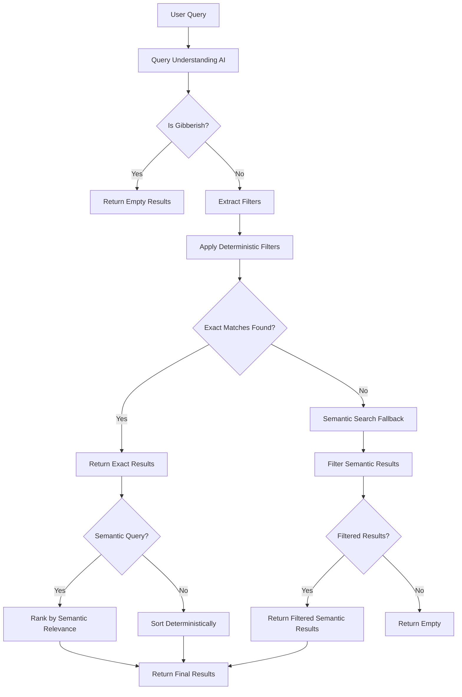

# Haalarikone

**Haalarikone** is Finland's easiest overall database – a unique way to explore Finnish student culture through colors. Find out what color overall a student in a specific field wears!

## Overview

- **What it does:**  
  It helps you identify students' fields based on their signature overall colors.

- **Explore culture:**  
  Discover and learn about the colorful traditions of Finnish student life.

## Live Site

Check out the live project at: [haalarikone.fi](https://haalarikone.fi)

## Tech Stack

- **Framework:** Next.js 15 (App Router) with React 18
- **Language:** TypeScript
- **Styling:** Tailwind CSS with Radix UI components (Shadcn/ui)
- **Internationalization:** next-intl (Finnish, English, Swedish)
- **Search:** AI-powered query understanding (Anthropic Claude) + deterministic filtering + semantic search (Upstash)
- **AI/ML:** Vercel AI SDK with Anthropic Claude 3 Haiku
- **Rate Limiting & Caching:** Upstash Redis
- **Email:** Resend (for feedback forms)
- **Analytics:** Databuddy
- **Testing:** Playwright
- **Package Manager:** pnpm
- **Deployment:** Vercel

## Prerequisites

Before you begin, ensure you have the following installed:

- **Node.js** (LTS version recommended)
- **pnpm** (package manager)
- **Git**

## Getting Started

### 1. Clone the Repository

```bash
git clone https://github.com/YOUR_USERNAME/haalarikone.git
cd haalarikone
```

### 2. Install Dependencies

```bash
pnpm install
```

### 3. Set Up Required Services

#### Upstash (Required)

The application requires Upstash for search functionality and rate limiting. Follow these steps to set up Upstash:

1. **Create an Upstash account:**
   - Go to [upstash.com](https://upstash.com) and sign up for a free account

2. **Create an Upstash Redis database:**
   - Navigate to the Redis tab in your Upstash console
   - Click "Create Database"
   - Choose a name and region closest to your deployment
   - Copy the **REST URL** and **REST TOKEN** from the database details page

3. **Create an Upstash Search index:**
   - Navigate to the Search tab in your Upstash console
   - Click "Create Index"
   - Name it `haalarikone-db`
   - Copy the **REST URL** and **REST TOKEN** from the index details page

4. **Get an Anthropic API key:**
   - Go to [console.anthropic.com](https://console.anthropic.com)
   - Sign up or log in
   - Navigate to API Keys
   - Create a new API key and copy it

#### Resend (Optional - for feedback form)

5. **Get a Resend API key (optional):**
   - Go to [resend.com](https://resend.com)
   - Sign up or log in
   - Create an API key
   - Note: If not configured, the feedback form will fail silently without visible errors

### 4. Environment Variables

Create a `.env.local` file in the root directory with the following variables:

```env
# Upstash Search (Required)
UPSTASH_SEARCH_REST_URL=your_upstash_search_rest_url
UPSTASH_SEARCH_REST_TOKEN=your_upstash_search_rest_token

# Upstash Redis (Required - for rate limiting and caching)
UPSTASH_REDIS_REST_URL=your_upstash_redis_rest_url
UPSTASH_REDIS_REST_TOKEN=your_upstash_redis_rest_token

# Anthropic (Required - for AI-powered search)
ANTHROPIC_API_KEY=your_anthropic_api_key

# Resend (Optional - feedback form only, fails silently if missing)
RESEND_API_KEY=your_resend_api_key
FEEDBACK_EMAIL_TO=your_email@example.com
```

**Note:** 
- **Required keys:** UPSTASH_SEARCH_REST_URL, UPSTASH_SEARCH_REST_TOKEN, UPSTASH_REDIS_REST_URL, UPSTASH_REDIS_REST_TOKEN, ANTHROPIC_API_KEY
- **Optional keys:** RESEND_API_KEY, FEEDBACK_EMAIL_TO (feedback form fails silently if missing)
- The app uses `localePrefix: 'as-needed'` - Finnish (default) has no prefix, other locales use `/en` or `/sv`

### 5. Run the Development Server

```bash
pnpm run dev
```

Open [http://localhost:3000](http://localhost:3000) in your browser to see the app.

### 6. Run Tests

```bash
pnpm test
```

To view the test report:

```bash
pnpm exec playwright show-report
```

## Project Structure

```
student-overall-app/
├── app/                    # Next.js App Router pages
│   ├── [locale]/          # Localized routes (fi, en, sv)
│   │   ├── ala/           # Field pages
│   │   ├── alue/          # Area pages
│   │   ├── blog/          # Blog posts
│   │   ├── haalari/       # Overall detail pages
│   │   ├── oppilaitos/    # University pages
│   │   ├── vari/          # Color pages
│   │   └── page.tsx       # Home page
│   ├── api/               # API routes (search, upsert)
├── components/            # React components
│   ├── ui/                # Reusable UI components (Radix UI)
│   ├── search-modal.tsx   # Search functionality
│   ├── language-switcher.tsx  # i18n language switcher
│   ├── theme-switcher.tsx # Dark/light mode toggle
│   └── ...                # Feature components
├── content/               # Blog post content (JSON)
├── data/                  # Static data files
├── i18n/                  # Internationalization config
│   ├── routing.ts         # Route configuration
│   └── request.ts         # Request locale handling
├── lib/                   # Utility functions and helpers
│   ├── route-translations.ts  # Route segment translations
│   ├── slug-translations.ts   # Entity slug translations
│   ├── translate-path-client.ts  # Client-side path translation
│   ├── query-understanding.ts  # AI-powered query parsing
│   ├── deterministic-filter.ts  # Exact filter matching
│   ├── semantic-search.ts      # Vector/semantic search fallback
│   ├── semantic-ranking.ts     # Result ranking by relevance
│   ├── load-color-data.ts      # Dynamic color data from JSON
│   └── ...                # Other utilities
├── messages/              # Translation files (fi.json, en.json, sv.json)
├── types/                 # TypeScript type definitions
├── utils/                 # Utility functions
└── tests/                 # Playwright tests
```

## Available Scripts

- `pnpm run dev` - Start development server with Turbopack
- `pnpm run build` - Build production bundle with Turbopack
- `pnpm run start` - Start production server
- `pnpm test` - Run Playwright tests
- `pnpm exec playwright show-report` - View test report after running tests

## Features

- **Multi-language Support:** Finnish (default), English, and Swedish
- **AI-Powered Search:** Intelligent query understanding with exact result counts
- **Route Translation:** Automatic translation of route segments and slugs
- **Blog System:** Static blog posts with multi-language support
- **Theme Support:** Dark and light mode
- **Responsive Design:** Mobile-first approach with Tailwind CSS
- **SEO Optimized:** Dynamic metadata, sitemap, and structured data

## Search Architecture

The search system uses a hybrid approach combining AI-powered query understanding with deterministic filtering and semantic search fallback.

### How It Works



### Search Flow

1. **Query Understanding (AI)**
   - Uses Anthropic Claude 3 Haiku to parse natural language queries
   - Extracts structured filters: color, area, field, school
   - Handles Finnish morphology (plural forms, case endings, genitive case)
   - Detects gibberish queries for early exit
   - Returns remaining semantic query text for ranking

2. **Deterministic Filtering**
   - Applies exact filters on local JSON dataset (~6000 records)
   - Guarantees exact result counts (no arbitrary limits)
   - Filters by: color (with variant matching), area, field, school
   - Fast in-memory filtering with caching

3. **Semantic Search Fallback**
   - Only triggered when exact filters return 0 results
   - Uses Upstash Search for vector/semantic search
   - Applies same filters to semantic results
   - Ensures semantic results still match filter criteria

4. **Ranking**
   - If semantic query exists, ranks results by keyword relevance
   - Otherwise, sorts deterministically (by school, then field)
   - Exact matches are always prioritized

### Key Benefits

- **Exact Counts:** Always returns complete result sets, not limited to top N
- **Intelligent Parsing:** Understands natural language queries in Finnish, English, Swedish
- **Fast Performance:** Deterministic filtering is ~10-50ms, AI parsing ~200-400ms
- **Fallback Safety:** Semantic search only when needed, still respects filters

## Development Guidelines

### Code Style

- **TypeScript:** Strict mode enabled
- **Formatting:** Prettier (configured)
- **Linting:** TypeScript compiler checks
- **Comments:** Minimal comments (per project preferences)

### Component Structure

- Use functional components with TypeScript
- Prefer server components when possible (Next.js App Router)
- Client components should be marked with `"use client"` directive
- Use path aliases (`@/`) for imports

### Internationalization

- All user-facing text should be in translation files (`messages/*.json`)
- Use `useTranslations` hook for client components
- Use `getTranslations` for server components
- Route segments are automatically translated via `route-translations.ts`
- Entity slugs (universities, fields, colors) are translated via `slug-translations.ts`

### Styling

- Use Tailwind CSS utility classes
- Custom components in `components/ui/` use Radix UI primitives
- Theme support via `next-themes`
- Responsive breakpoints: `sm:`, `md:`, `lg:`, `xl:`

## Testing

Tests are written using Playwright and located in the `tests/` directory. The test configuration runs tests against Chromium, Firefox, and WebKit.

To run tests in a specific browser:

```bash
pnpm exec playwright test --project=chromium
```

## Contributing

We welcome contributions! Please see [CONTRIBUTING.md](./CONTRIBUTING.md) for guidelines on how to contribute to this project.

## Contact

For any questions or feedback, feel free to reach out:

- **Email:** [savonen.emppu@gmail.com](mailto:savonen.emppu@gmail.com)
- **GitHub:** [@valtterisa](https://github.com/valtterisa)

## License

See [LICENSE](./LICENSE) file for details.

---

Made by [@valtterisa](https://github.com/valtterisa)
